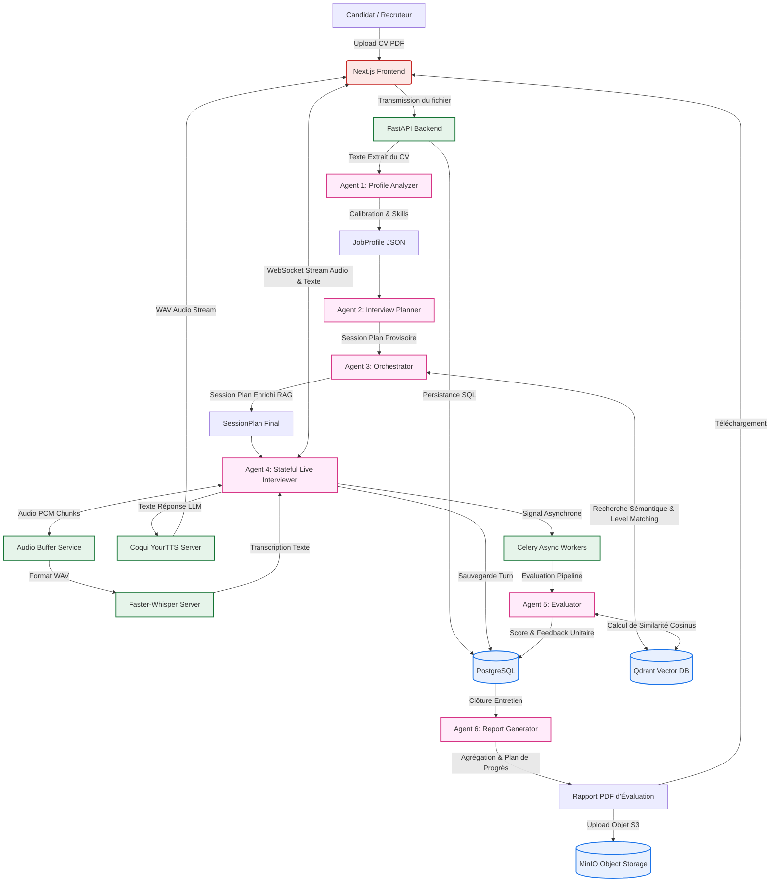

# InterviewAI : Plateforme Multi-Agent d'Évaluation Automatisée et de Simulation d'Entretiens Techniques

[](#)
[](#)
[](#)
[](#)
[](#)
[](#)

---

## 📝 Résumé de Recherche / Abstract

L'évaluation des compétences techniques lors du recrutement traditionnel souffre de biais subjectifs, de goulots d'étranglement logistiques et de coûts élevés. **InterviewAI** répond à cette problématique en introduisant une architecture multi-agent cognitive hautement distribuée, orchestrée par **LangGraph**. Le système automatise de bout en bout le processus d'évaluation technique : de l'ingestion et de l'analyse sémantique du CV à la conduite d'un entretien dynamique en temps réel (via WebSockets avec synthèse vocale locale), jusqu'à l'évaluation hybride des réponses (comparaison vectorielle par rapport à un référentiel Qdrant combinée à un jugement cognitif par LLM). Cette approche garantit une standardisation rigoureuse, une personnalisation dynamique basée sur le profil du candidat, ainsi qu'une confidentialité totale grâce au déploiement de modèles audio (STT et TTS) auto-hébergés.

---

## 🏗️ Architecture Globale du Système

La plateforme repose sur l'interaction synchrone et asynchrone de micro-services conteneurisés. Le flux de données, de l'importation du profil jusqu'au rapport final de performance, est schématisé ci-dessous :



---

## 🤖 Les 6 Agents Cognitifs (Orchestration LangGraph)

Le cœur de décision d'InterviewAI est découpé en plusieurs agents autonomes basés sur des graphes d'états dynamiques (**LangGraph StateGraph**). L'LLM de référence utilisé pour le raisonnement est **Llama 3.3 70B Versatile** hébergé sur Groq pour ses performances de vitesse exceptionnelles.

### 1. Agent 1 — Profile Analyzer
* **Fichier** : [profile_analyzer.py](file:///home/marouane-mounir/projects/multi-agent-system-for-interview-simulation/backend/app/agents/profile_analyzer.py)
* **Description** : Analyse le texte brut extrait du CV (par `pypdf`/`python-docx`).
* **Fonctions clés** :
  - Extraction structurée (`formations`, `experiences`, `projects`, `certifications`, `detected_skills`).
  - Détection sémantique des écarts de compétences (`skill_gaps`) vis-à-vis de l'offre d'emploi cible.
  - Calibration automatique de la séniorité (`junior`, `mid`, `senior`, `lead`) à partir des faits décrits plutôt que des titres auto-proclamés.

### 2. Agent 2 — Interview Planner
* **Fichier** : [interview_planner.py](file:///home/marouane-mounir/projects/multi-agent-system-for-interview-simulation/backend/app/agents/interview_planner.py)
* **Description** : Reçoit le profil calibré et conçoit le déroulement logique et chronologique de l'entretien.
* **Fonctions clés** :
  - Génération d'ancres de discussion (`anchors`) catégorisées : *opener* (mettre en confiance sur un sujet maîtrisé), *core* (validation technique et vérification des écarts/gaps) et *closer* (compétences douces, motivation).
  - Allocation temporelle dynamique stricte (calculée pour respecter la durée globale).
  - Personnalisation selon le type d'entretien demandé (purement technique, purement comportemental ou mixte).

### 3. Agent 3 — Orchestrator (RAG Manager)
* **Fichier** : [orchestrator.py](file:///home/marouane-mounir/projects/multi-agent-system-for-interview-simulation/backend/app/agents/orchestrator.py)
* **Description** : Réalise l'ancrage des questions dans des données validées (RAG) pour éviter les hallucinations pures de l'LLM.
* **Fonctions clés** :
  - Extraction des concepts-clés des ancres générées par le planificateur.
  - Recherche vectorielle de proximité (Semantic Search) dans **Qdrant** sur la collection de questions de référence.
  - Enrichissement du plan avec les questions d'ouverture et les réponses de référence issues de la base.

### 4. Agent 4 — Stateful Live Interviewer
* **Fichier** : [interviewer.py](file:///home/marouane-mounir/projects/multi-agent-system-for-interview-simulation/backend/app/agents/interviewer.py)
* **Description** : Agent interactif principal maintenant l'état de la discussion au fil de l'eau.
* **Fonctions clés** :
  - Boucle de raisonnement **ReAct** (Observe $\rightarrow$ Assess $\rightarrow$ Decide $\rightarrow$ Act) exécutée sur chaque réponse du candidat.
  - Choix d'action contextuel : `follow_up` (creuser un point précis), `probe_gap` (vérifier subtilement une zone d'ombre), `acknowledge_move` (acter la réponse et passer à l'ancre suivante), ou `close` (conclure l'entretien).
  - **Question Guard** : Mécanisme de sécurité interceptant les formulations pour empêcher les termes trop techniques ou hors-sujet en mode comportemental.

### 5. Agent 5 — Evaluator (Hybrid Evaluation)
* **Fichier** : [evaluator.py](file:///home/marouane-mounir/projects/multi-agent-system-for-interview-simulation/backend/app/agents/evaluator.py)
* **Description** : Évalue de manière asynchrone chaque réponse du candidat juste après sa soumission.
* **Fonctions clés** :
  - **Système d'évaluation Hybride** : Calcule un score sémantique (similarité cosinus via les embeddings Qdrant entre la réponse du candidat et la réponse de référence) et le combine avec un score cognitif multi-critères du LLM (Pondération 60% LLM / 40% Vector Similarity).
  - Calcul de notes sur 10 selon des grilles d'évaluation adaptées au type d'ancre (Technique : exactitude, profondeur ; Comportemental : structure STAR, clarté).

### 6. Agent 6 — Report Generator
* **Fichier** : [report_generator.py](file:///home/marouane-mounir/projects/multi-agent-system-for-interview-simulation/backend/app/agents/report_generator.py)
* **Description** : Génère le bilan global de l'entretien à sa clôture.
* **Fonctions clés** :
  - Agrégation mathématique des scores par domaine de connaissances.
  - Rédaction d'une synthèse narrative personnalisée de l'entretien (300-400 mots).
  - Établissement d'un **plan d'action d'amélioration en 5 étapes** précises avec ressources d'apprentissage recommandées et calendrier d'exécution.

---

## 🎙️ Pipeline Multimodal Temps Réel (STT & TTS)

La fluidité d'un entretien réside dans la vitesse de traitement. L'architecture utilise un pipeline asynchrone en streaming :

1. **Streaming Audio Bidirectionnel** :
   Le frontend communique avec le backend FastAPI en utilisant des protocoles WebSockets bidirectionnels. Le candidat parle dans son micro, et les chunks audio brute PCM 16-bit sont transmis en continu.

2. **Speech-to-Text (STT) - Faster-Whisper** :
   * **Fichier Service** : [stt_service.py](file:///home/marouane-mounir/projects/multi-agent-system-for-interview-simulation/backend/app/services/stt_service.py)
   * Le service encapsule un serveur Faster-Whisper configuré avec la quantification **INT8** (optimisation CPU/GPU).
   * L'audio PCM est converti à la volée en WAV structuré avant d'être envoyé au serveur STT local pour obtenir des transcriptions rapides et précises.

3. **Text-to-Speech (TTS) - Coqui-TTS** :
   * **Fichier Service** : [tts_service.py](file:///home/marouane-mounir/projects/multi-agent-system-for-interview-simulation/backend/app/services/tts_service.py)
   * Génère l'audio de la voix du recruteur virtuel en utilisant le modèle multilingue auto-hébergé `your_tts`.
   * L'audio généré est renvoyé en continu sous forme de flux WAV binaire vers le frontend.

---

## 💾 Schéma de Base de Données et Stockage

La plateforme orchestre trois types de stockage spécialisés :

### 1. Base Relationnelle : PostgreSQL 16 (modélisé par SQLAlchemy)
* **Utilisateurs (`users`)** : Gestion des comptes recruteurs et candidats.
* **Profils Candidats (`candidate_profiles`)** : Données extraites du CV, score de correspondance initial avec le poste.
* **Fichiers CV (`resumes`)** : Métadonnées et hachages SHA-256 pour éviter les doublons de CV.
* **Sessions (`sessions`)** : Informations de l'entretien en cours (état, type, plan complet).
* **Échanges (`exchanges`)** : Logs complets de chaque tour (Question, Réponse, métadonnées temporelles, raisonnement interne ReAct).
* **Évaluations (`evaluations`)** : Notes unitaire (exactitude, clarté, profondeur, STAR) et retours constructifs.
* **Rapports (`reports`)** : Synthèse finale, score global agrégé et métadonnées du PDF final.
* **Statistiques d'utilisation (`token_usage`)** : Suivi fin de la consommation de jetons Groq et coûts associés.

### 2. Base Vectorielle : Qdrant v1.13.0
* **Collection `questions_bank`** : Banque de questions techniques et comportementales de référence pré-indexées.
* **Collection `candidate_memories`** : Permet la conservation de contextes sémantiques transverses.

### 3. Stockage d'Objets S3-Compatible : MinIO
* Stockage des enregistrements audio de sessions sous forme de fichiers WAV.
* Stockage des rapports PDF d'évaluation générés dynamiquement par le Celery Worker.

---

## ⚙️ Guide de Déploiement et d'Exécution

Le projet est entièrement orchestré via **Docker Compose** pour simplifier son installation.

### Prérequis
* Docker & Docker Compose (v2.20+) installé sur votre machine.
* Une clé d'API valide pour **Groq** (`gsk_...`).

### Étape 1 : Cloner le Dépôt
```bash
git clone https://github.com/Marouanemounir/interview-ai-platform.git
cd interview-ai-platform
```

### Étape 2 : Configurer les Variables d'Environnement
Copiez le fichier d'exemple et renseignez vos variables :
```bash
cp .env.example .env
```
Assurez-vous de renseigner la clé d'API Groq dans le fichier `.env` :
```env
GROQ_API_KEY=votre_cle_api_groq_ici
```

### Étape 3 : Démarrer la Stack de Conteneurs
```bash
docker-compose up -d
```
> ⚠️ **Note sur le premier démarrage** : Lors de la première exécution, les conteneurs `whisper` et `tts` téléchargeront les modèles de deep learning nécessaires (Faster-Whisper large/medium et Coqui YourTTS, soit environ 3 à 4 Go cumulés). Cette étape peut prendre 5 à 10 minutes selon votre vitesse de connexion internet.

### Étape 4 : Initialiser la Base Vectorielle
Pour peupler votre base vectorielle Qdrant locale avec des questions de test pré-configurées :
```bash
docker-compose exec backend python seed_questions.py
```

---

## 🔗 Services et Panneaux d'Administration Exposés

Une fois démarré, vous pouvez accéder aux différents ports exposés sur votre machine locale :

| Service | Rôle | URL Locale |
| :--- | :--- | :--- |
| **Frontend UI** | Interface web candidat/recruteur Next.js | [http://localhost:3000](http://localhost:3000) |
| **Backend API** | Documentation interactive FastAPI Swagger | [http://localhost:8000/docs](http://localhost:8000/docs) |
| **pgAdmin 4** | Console d'administration PostgreSQL | [http://localhost:5050](http://localhost:5050) |
| **RedisInsight** | Visualisation du cache et des files d'attente Redis | [http://localhost:5540](http://localhost:5540) |
| **Flower** | Suivi en temps réel des tâches distribuées Celery | [http://localhost:5555](http://localhost:5555) |
| **MinIO Console** | Gestionnaire de fichiers S3 (Audios et PDFs) | [http://localhost:9001](http://localhost:9001) |

---

## 📄 Licence et Contribution

Ce projet a été réinitialisé et appartient exclusivement à **Marouane Mounir**.
Pour toute suggestion d'amélioration académique, technique ou signalement de bug, n'hésitez pas à ouvrir une Issue ou à soumettre une Pull Request sur le dépôt officiel.
